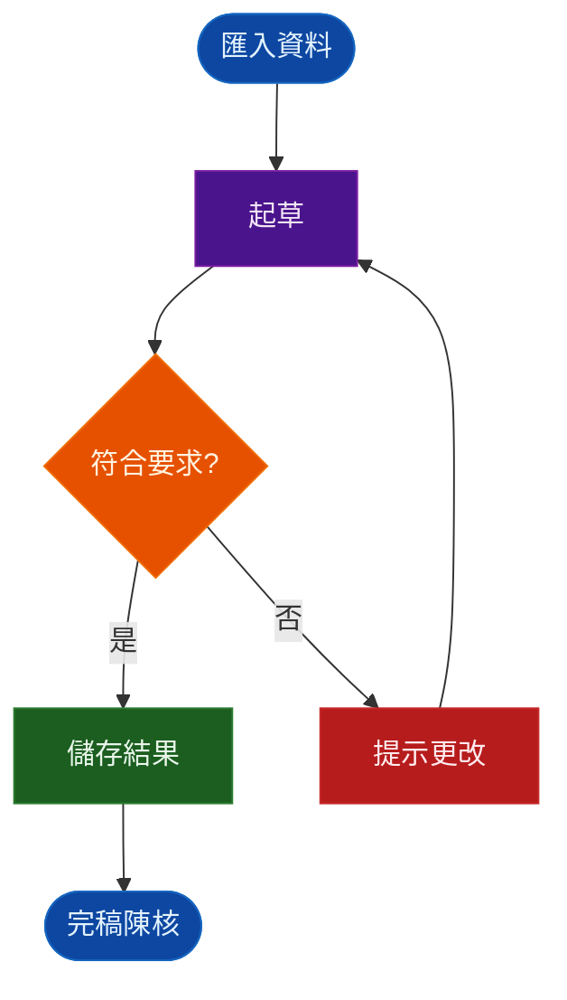

^frontmatter

# 新聞稿 AI 協作指南
<!-- .element: class="r-fit-text" -->

兼顧效率、資安與正確性的 AI 起草 SOP
<!-- .element: class="r-fit-text" -->

<div class="hide-from-slides">

> [!table|share-none]
>> [!table|right]
>> 狀態：`INPUT[inlineSelect(option(🌱 下種), option(🪴 發展), option(👣 追蹤), option(🥾 交付), option(✅ 完成), option(🌲 常青), option(❌ 取消), showcase):status]`
>> 主題：`INPUT[inlineSelect(option(beige), option(black), option(blood), option(dracula), option(league), option(moon), option(night), option(serif), option(simple), option(sky), option(solarized), option(white), showcase):theme]`
>> 切換：`INPUT[inlineSelect(option(none), option(fade), option(slide), option(convex), option(concave), option(zoom), showcase):transition]`
>
> [up:: [[傳題]], [[Base_投影片.base|投影片]]] [[#^current-note-path|目前位置]] [[Slides|模板]]
> ```meta-bind-button
> style: default
> label: 開啟簡報
> tooltip: 'presentation'
> id: presentation
> hidden: false
> action:
>   type: command
>   command: slides:start
> ```
>
> ```meta-bind-button
> style: default
> label: RevealJS
> tooltip: 'Slides Extended: Show slide preview'
> id: RevealJS
> hidden: false
> action:
>   type: command
>   command: slides-extended:open-preview
> ```

> [!right]
> 修改@`$=dv.span(dv.current().date_modified)`

</div><!-- element style="display: none;" -->

---

<!-- 第 (#/1) 頁 -->

## 大綱
<!-- .element: style="display:none;" -->

> [!flex]
>> [!outline|slide-hide] [簡報]新聞稿 AI 協作指南
>> - [[#為什麼用 AI 寫新聞稿？]]
>> - [[#從資料到新聞稿的整體流程]]
>> - [[#這件事是怎麼運作的？]]
>> - [[#Gemini Notebook 優勢與限制]]
>> - [[#資料來源怎麼分工？]]
>> - [[#資料收集、整理與資安規範]]
>> - [[#提示詞：讓 AI 知道「要做什麼」]]
>> - [[#現場 Live 示範]]
>> - [[#AI 初稿的承辦人查核重點]]
>> - [[#結語與 Q&A]]
><!-- .element: style="display:none;" -->
>
>> [!outline|color-purple|reading-view-hide] [簡報]新聞稿 AI 協作指南
>> - [為什麼用 AI 寫新聞稿？](#/2)
>> - [從資料到新聞稿的整體流程](#/3)
>> - [這件事是怎麼運作的？](#/4)
>> - [Gemini Notebook 優勢與限制](#/5)
>> - [資料來源怎麼分工？](#/6)
>> - [資料收集、整理與資安規範](#/7)
>> - [提示詞：讓 AI 知道「要做什麼」](#/8)
>> - [現場 Live 示範](#/9)
>> - [AI 初稿的承辦人查核重點](#/10)
>> - [結語與 Q&A](#/11)
>


```dataviewjs
'產出大綱'
// 取得當前檔案內容
const file = dv.current().file;
const content = await app.vault.read(app.vault.getAbstractFileByPath(file.path));
const lines = content.split("\n");

// 初始化參數
let currentSlide = -2; // 簡報頁碼通常從 0 或 1 開始
const headings_reveal = [];

// 遍歷所有行，計算頁碼與標題
for (let i = 0; i < lines.length; i++) {
	const line = lines[i].trim();

	// 檢測水平分頁 (---) 或垂直分頁 (----)
	// 這裡視你的簡報結構而定，若無垂直分頁，只需判斷 "---"
	if (line === "---" || line === "----") {
		currentSlide++;
		continue;
	}

	// 匹配標題 (##, ###, ####)
	const m = line.match(/^(#{2,4})\s+(.*)/);
	if (!m) continue;

	const level = m[1].length;
	const title = m[2].trim();

	headings_reveal.push({ level, title, slide: currentSlide });
}

// 產生輸出區塊
let slide_block = "";
let reading_block = "";
const baseLevel = 2; // 基準層級

for (const h of headings_reveal) {
	if (h.title != "大綱") {
		const indent = "  ".repeat(h.level - baseLevel);
	
		// Slide 連結 (Reveal.js 格式)
		const slideLink = h.level === 2 ? `(#/${h.slide})` : `(#/${h.slide}/0/0)`;
		slide_block += `>> ${indent}- [${h.title}]${slideLink}\n`;
	
		// Reading View 連結 (Obsidian 內部連結)
		reading_block += `>> ${indent}- [[#${h.title}]]\n`;
	}
}

// 組合最終 Markdown 結構
const output = `
> [!flex]
>> [!outline|slide-hide] **大綱 (預覽)**
${reading_block}
>
>> [!outline|color-blue|reading-view-hide] **大綱 (簡報)**
${slide_block}
`;

// 輸出到頁面
dv.span(output);
```
<!-- .element: style="display:none;" -->

```dataviewjs [1-2]
'產出可複製代碼'
const file = dv.current().file;
const content = await this.app.vault.read(app.vault.getAbstractFileByPath(file.path));
const lines = content.split("\n");
const file_name = file?.name;

// 解析 slide 頁碼（從 HTML 註解抓 (#/n)）
function getSlideIndex(i) {
	for (let j = i - 1; j >= 0; j--) {
		// 修改：增加對強制分隔符 --- 的捕捉，或者確保能抓到更完整的錨點
		const m = lines[j].match(/#\/(\d+)/);
		if (m) return m[1];
	}
	// 如果找不到，給一個預設值，而不是 return null
	return "1";
}

// 擷取標題
const headings_reveal = [];
for (let i = 0; i < lines.length; i++) {
	const line = lines[i];
	const m = line.match(/^(#{2,4})\s+(.*)/);
	if (!m) continue;

	const level = m[1].length; // ## = 2, ### = 3, #### = 4
	const title = m[2].trim();
	const slide = getSlideIndex(i);

	if (slide) {
		headings_reveal.push({ level, title, slide });
	}
}

// 基準層級
const baseLevel = 2;

// 產生階層清單
let slide_block = "";
let reading_block = "";

for (const h of headings_reveal) {
	if (h.title != "大綱") {
		const indent = "  ".repeat(h.level - baseLevel);
		const link =
			h.level === 2
				? `(#/${h.slide})`
				: `(#/${h.slide}/0/0)`;
		// Slide Mode 標記，裡面是 Reveal/Slide 專用標記
		slide_block += `>> ${indent}- [${h.title}]${link}\n`;
		// Reading View 標記
		reading_block += `>> ${indent}- [[#${h.title}]]\n`;
	}
}

// 輸出，無法顯示在reading-view，因為slide_block無法渲染
let link_block = "> [!flex] \n>> [!outline|slide-hide] " + file_name + "\n" + reading_block + ">\n>> [!outline|color-purple|reading-view-hide] " + file_name + "\n>>\n>>" + slide_block
// 輸出，可以顯示在reading-view，但slide_block要手動貼上
let code_block = "> [!flex] \n>> [!outline|slide-hide] " + file_name + "\n" + reading_block + ">\n>> [!outline|color-blue|reading-view-hide] " + file_name + "\n>>\n>> ````text\n" + slide_block + ">> ````\n";
let code_pure = `
\`\`\`\`markdown
> [!flex]
>> [!outline|slide-hide] ${file_name}
${reading_block}><!-- .element: style=\"display:none;\" -->
>
>> [!outline|color-purple|reading-view-hide] ${file_name}
${slide_block}>
\`\`\`\`
`;

// 顯示為大綱及文字區塊
dv.paragraph(code_pure);
```
<!-- .element: style="display:none;" -->

---

<!-- 第 (#/2) 頁 -->

## 為什麼用 AI 寫新聞稿？

- 解決歷年稿件搜尋、比對、起草耗時問題
- AI 定位：**新聞稿起草助理**
- 責任邊界：**AI 不取代承辦人的專業判斷**


%%
Note:
2min
%%

[回大綱](#/1)

[[#大綱|回大綱]]

---

<!-- 第 (#/3) 頁 -->

## 從資料到新聞稿的整體流程
<!-- .element: style="display:none;" -->

<iframe src="https://mermaid.live/embed?theme=dark&look=classic&mode=dark&controls=0#pako:eNpdUMtO20AU_RVrsimSkWwnTlIvQCQOX8CKOIvJ-E5i4mSisSMWSRYgqrYSVbNACFSEuigRCwqiFPHY8DV2wl9g_IrJ7O6555x7zgwRYSYgDVGb7ZI25q6wpRs9IXgbn-re4Y335WJ-99U_Pm2sCKura0KlPr9_mP_43ohIlRCsDmdXU2_ybT7d82_318fRrhruRv7JzUjQ697BP-_vyex-4p-fNT4QvMl0JNTq_s_J7M-z_-u_f_QUE_SQsBkEuT6cXb68nt75vx8bK9GyFuUxetFIbOw4OlDBcd9bUMu2tZxkFkpYFh2Xsw5oOVktqkQSCbMZ13KQpwo1l9R9zgg4TqwvYLlQJqm-1JQpVhI9zYNK1SW9CcRyLNaLDaCoypKUGgAtEikNQGlgIS0ZcNgBkuRvlmQiL-6TolJWygs5NAGW2w9IJr_cVEFZnFegZObT_FCmKnyO9BkXYUPcjD4xC1aSn8mC1bRuFq3FHbKYngRDImpxy0Saywcgoi7wLn4f0dBAbhu6YCDNQCbmHQOJBrIZ64RIaGMRA40Dhz7ubTPWTUw4G7TaSKPYdoJp0DexC7qFWxzHlPEbtvIEdg" width="100%" height="800vh" style="border:0" loading="lazy" title="Mermaid diagram" sandbox="allow-scripts allow-same-origin allow-popups allow-popups-to-escape-sandbox"></iframe>


%%

%%

%%
Note:
2min
%%

[示範](#/9)|[回大綱](#/1)

[[#大綱|回大綱]]

---

<!-- 第 (#/4) 頁 -->

## 這件事是怎麼運作的？

- 提供歷年奉核新聞稿 → 模仿既有公務寫作風格
- 提供其他區局稿件 → 協助發掘選題
- 提供法規來源 → **協助回溯 AI 撰稿依據**
- **來源引註不是法規查核**

%%
Note:
2min
%%

[回大綱](#/1)

[[#大綱|回大綱]]

---

<!-- 第 (#/5) 頁 -->

## Gemini Notebook 優勢與限制
<!-- .element: class="r-fit-text" -->


> [!flex]
>> [!info] 適合
>> - 大量新聞稿的快速閱讀與比對
>> - 模仿既有寫作風格
>> - 找尋過往選題
>> - 產生初稿
>> - 提供來源標號供回看
>
>> [!warning] 不能
>> - 不能取代法規查核
>> - 不能保證條文目前仍有效
>> - 不能保證案例數字計算正確
>> - 不會因原始 URL 更新而自動更新來源

%%
Note:
2min
%%

[回大綱](#/1)

[[#大綱|回大綱]]

---

<!-- 第 (#/6) 頁 -->

## 資料來源怎麼分工？

|資料|用途|
|--|--|
|臺北國稅局奉核稿|學習口吻、結構、敘事方式|
|其他區局新聞稿|選題、標題、案例方向參考|
|法規／函釋來源|提供撰稿參考及來源回溯|

> **不同資料來源有不同任務，不是全部丟進去讓 AI 自己判斷。**

%%
Note:
2min
%%

[回大綱](#/1)

[[#大綱|回大綱]]

---

<!-- 第 (#/7) 頁 -->

## 資料收集、整理與資安規範

%%
- **內網極簡取得**：公用區 `00.新聞稿` 資料夾已備妥 111~114 年純文字.md 檔案，同仁僅需補齊最新年度(115)資料。
- **外網輔助工具**：提供其他區局官網新聞稿連結
	ps. 亦提供自動化 Python 腳本，協助擷取其他區局官網新聞稿並轉為.md 檔。
- **資安鐵律**：嚴禁上傳未公開案件資料、納稅人個資或內部簽辦公文。
%%

- 內網 `.md` 新聞稿資料
- 其他區局官網新聞稿
- 法規來源連結
- Notebook 來源管理與更新
- **不得上傳未公開案件資料、個資及內部簽辦資料**

%%
Note:
3min
%%

[回大綱](#/1)

[[#大綱|回大綱]]

---

<!-- 第 (#/8) 頁 -->

## 提示詞：讓 AI 知道「要做什麼」

> [!flex]
>> [!note] 提問要素結構
>> 1. 目標月份／稅目／篇數
>> 2. 選題限制
>> 3. 寫作風格
>> 4. 日期、金額、案例限制
>> 5. 輸出格式與來源引註
>> - **🔗 提示詞（Prompt）**：
>> 	- [速查手冊連結](https://eumenr.pages.dev/心流/新聞稿ai實戰指南/新聞稿-ai-協作速查手冊)：如右QRcode。
>
>


%%
Note:
簡報現場可放置 QR Code 供同仁手機/電腦一鍵複製 Prompt
https://goqr.me
%%

[回大綱](#/1)

[[#大綱|回大綱]]

---

<!-- 第 (#/9) 頁 -->

## 現場 Live 示範

1. 勾選來源
2. 貼上[[提示詞](https://eumenr.pages.dev/心流/新聞稿ai實戰指南/新聞稿-ai-協作速查手冊)]
3. 產出新聞稿
4. 點來源回溯
5. 發現問題 → 貼修稿提示詞 → 重新產出

%%
Note:
3min
%%

[流程](#/3)|[回大綱](#/1)

[[#大綱|回大綱]]

---

<!-- 第 (#/10) 頁 -->

## AI 初稿的承辦人查核重點

%%
- 第一階段：**AI 標記初檢**
- 第二階段：**承辦人實質審查**
	- **法規對照**：對照最新法規及解釋令函（確認條號、申報期限與罰則）。
	- **數字重算**：使用計算機重新演算案例金額、稅額與日期，確保金額計算無誤且未混淆含稅/未稅。
	- **題材檢查**：確認無誤植外局機關名稱或電話。
- 第三階段：**最終公文審查**
%%

> [!flex]
>> [!table]
>>
>> **① 法規**
>> - 條、項、款、次
>> - 適用要件
>> - 解釋函令
>>
>> **② 數字**
>> - 金額、稅額<br>(含稅/未稅)
>> - 日期、發票期別
>> - 計算邏輯
>
>> [!table]
>>
>> **③ 內容**
>> - 是否沿用舊稿案例
>> - 是否與近年本局主題重複
>> - 是否誤植其他區局名稱、地區或聯絡資訊
>> - AI 來源是否真的支持該句內容

%%
Note:
防呆機制
%%

[回大綱](#/1)

[[#大綱|回大綱]]

---

<!-- 第 (#/11) 頁 -->

## 結語與 Q&A

- **核心口訣**：
	- 資料先整理
	- AI 助起草
	- 專業責任在承辦
- **相關連結資源**：
	- [簡報](https://eumenr.github.io/reservoir/Extra/Slides%20Extended/index_新聞稿%20AI%20協作指南.html)|[速查手冊](https://eumenr.pages.dev/心流/新聞稿ai實戰指南/新聞稿-ai-協作速查手冊)[](https://share.note.sx/leohu77r)
- **Q&A 時間**

%%
Note:
2min
%%

[回大綱](#/1)

[[#大綱|回大綱]]

---

<!-- 第 (#/12) 頁 -->

<!-- .slide: data-visibility="hidden" -->

# 總結

%%
Note:
本版本共 60 分鐘。

已刪除 Codex 相關內容，並簡化 Python 與 Colab 說明，讓完全沒有 IT 背景的同仁也能輕鬆上手。

簡報清楚劃分了「資料整理（免寫程式）」、「NotebookLM 匯入與發問（使用公式）」以及「完稿檢查（三對照防呆）」三大實務區塊。
%%

[[#大綱|回大綱]]